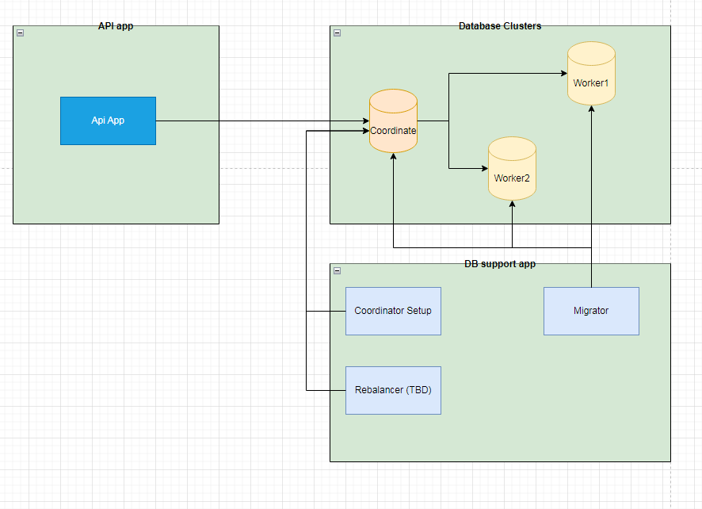
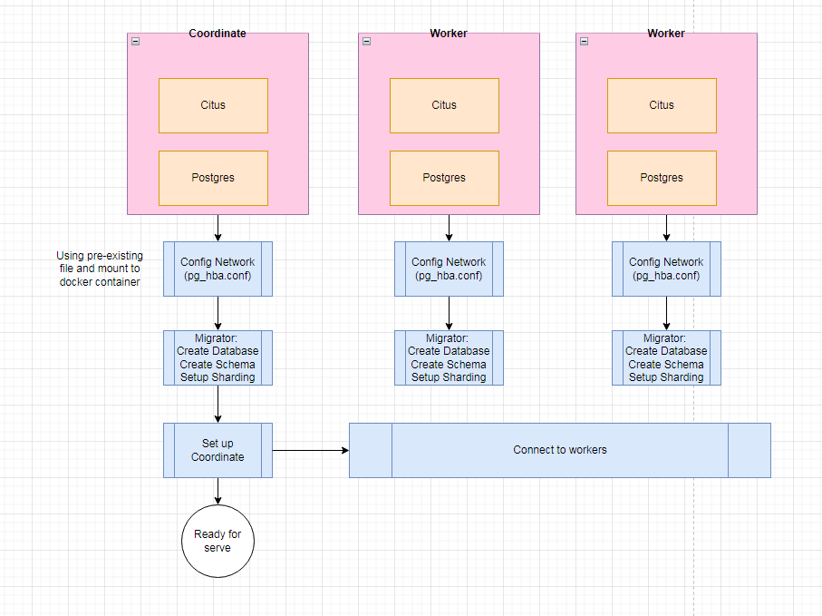

# Sharding example
An Example using Asp.net with Entity Framework and Postgre Sharding using Citus.
Which demonstrates how to config and use with docker-compose.

# Knowledge
- [Sharding](https://en.wikipedia.org/wiki/Shard_(database_architecture))
- [PostgreSQL](https://www.postgresql.org/)
- [Citus - Postgres Extension](https://docs.citusdata.com/en/stable/get_started/what_is_citus.html)
- [Entity Framework](https://docs.microsoft.com/en-us/ef/)
- [Postgresql Extensions in Entity Framework](https://www.npgsql.org/efcore/misc/other.html)
- [ASP.NET](https://dotnet.microsoft.com/apps/aspnet)
- [Docker](https://www.docker.com/)
- [Docker Compose](https://docs.docker.com/compose/)
- [Postgres pg_hba.conf](https://www.postgresql.org/docs/16/auth-pg-hba-conf.html)


# How to run
1. Clone the repository
2. Run the following command in the root directory of the project
```bash
docker-compose up
```
3. Open the browser and navigate to `http://localhost:11111/swagger/index.html`
4. You should see the swagger page with the endpoints.
5. You can use the endpoints to test the sharding.
6. To clean data and start over run the following command
```bash
docker-compose down
```

# Test
* Using swagger UI, let create some tenants
* Verify all node is connected to coordinate node:
```sql
SELECT * from citus_get_active_worker_nodes();
```
You should able to see some result like this:

| node\_name | node\_port |
| :--- | :--- |
| db\_worker2 | 5432 |
| db\_worker1 | 5432 |

* Verify all the data is distributed or not:
```sql
select nodename,nodeport, table_name, pg_size_pretty(sum(shard_size))
from citus_shards
group by nodename,nodeport, table_name;
```
You should able to see some result like this:

| nodename | nodeport | table\_name | pg\_size\_pretty |
| :--- | :--- | :--- | :--- |
| db\_coordinate | 5432 | users | 512 kB |
| db\_coordinate | 5432 | tenants | 544 kB |

So you can see that all data is not distributed yet, data is only in the coordinator node.

* To distribute the data, you can run this command:
```sql
SELECT citus_rebalance_start()
```
* To check the progress of the rebalance, you can run this command:
```sql
SELECT * FROM citus_rebalance_status();
```
You can see some result like this:

| job\_id | state | job\_type | description | started\_at | finished\_at | details |
| :--- | :--- | :--- | :--- | :--- | :--- | :--- |
| 1 | running | rebalance | Rebalance all colocation groups | 2024-06-07 08:39:14.654253 +00:00 | null | {"tasks": \[{"state": "runnable", "command": "SELECT pg\_catalog.citus\_move\_shard\_placement\(102009,1,2,'auto'\)", "message": "ERROR: ERROR:  logical decoding requires wal\_level &gt;= logical\\nCONTEXT: while executing command on db\_coordinate:5432\\nCitus Background Task Queue Executor: multitenantapp/postgres for \(1/1\)\\n", "retried": 3, "task\_id": 1}\], "task\_state\_counts": {"blocked": 20, "runnable": 1}} |

From the `details` we can see that the rebalance is running and there is some error in the rebalance process.
See the [Troubleshoot Issues](#troubleshoot-issues) section to fix the issue.

If you can see result like this:

| job\_id | state | job\_type | description | started\_at | finished\_at | details |
| :--- | :--- | :--- | :--- | :--- | :--- | :--- |
| 1 | finished | rebalance | Rebalance all colocation groups | 2024-06-07 12:29:26.721635 +00:00 | 2024-06-07 12:29:53.553231 +00:00 | {"tasks": \[\], "task\_state\_counts": {"done": 21}} |

That mean the rebalance is succeed.

* After that checking result of the rebalance, you can run this command:
```sql
select nodename,nodeport, table_name, pg_size_pretty(sum(shard_size))
from citus_shards
group by nodename,nodeport, table_name;
```
Now we can see the data is rebalanced and distributed to all nodes.

| nodename | nodeport | table\_name | pg\_size\_pretty |
| :--- | :--- | :--- | :--- |
| db\_worker2 | 5432 | users | 160 kB |
| db\_worker1 | 5432 | tenants | 224 kB |
| db\_coordinate | 5432 | users | 176 kB |
| db\_coordinate | 5432 | tenants | 192 kB |
| db\_worker1 | 5432 | users | 176 kB |
| db\_worker2 | 5432 | tenants | 192 kB |


# Architecture




# Troubleshoot Issues

1. Error log like:
```text
 connection to the remote node postgres@db_worker2:5432 failed with the following error: fe_sendauth: no password supplied
```
Still same problem with above, need to fix `pg_hba.conf`.

2. rebalance status is not work properly, you can see the error in the `details` column.
```text
ERROR:  logical decoding requires wal_level >= logical
```
This is because default `wal_level` is `replica`, need to change to `logical` and restart the container.
Remember u need to run this sql to update the `wal_level` in `db_coordinate` container
```sql
ALTER SYSTEM SET wal_level = logical;
```
then stop container and start again.
After start container again you can check the `wal_level` using this sql:
```sql
SHOW wal_level;
```
or edit docker-compose.yml and add this line in `db_coordinate` service:
```yaml
        command:
        - "postgres"
        - "-c"
        - "wal_level=logical"
```

# Useful Commands

```sql
-- View all active worker nodes
SELECT * from citus_get_active_worker_nodes();

-- Get only node name of active worker nodes
SELECT "node_name" FROM citus_get_active_worker_nodes();

-- Check is coordinator node or not
SELECT * FROM citus_is_coordinator();

-- set this node as coordinator
SELECT citus_set_coordinator_host('db_coordinator', 5432);

-- add new worker node as primary
SELECT * from citus_add_node('db_worker1', 5432, -1,'primary');

-- add new worker node as secondary
SELECT * from citus_add_node('db_worker2', 5432, -1, 'secondary');

-- get list of connection statuses between nodes
SELECT * FROM citus_check_cluster_node_health();

-- start rebalance asynchronously
SELECT citus_rebalance_start();

-- start rebalance synchronously
SELECT * from rebalance_table_shards();

-- get rebalance status
SELECT * FROM citus_rebalance_status();

-- get connection count to each node
SELECT * from citus_remote_connection_stats();

-- get shard table name of each shard table
SELECT * FROM citus_shards;

--- get shard configurations
SELECT * from pg_dist_shard;
SELECT * from pg_dist_placement;
SELECT * from pg_dist_node;

-- get rebalance strategy
SELECT * FROM pg_dist_rebalance_strategy;

-- change rebalance strategy
SELECT get_shard_id_for_distribution_column('tenants', 4)

-- find which node will contain the data for table `tenants` which id = 1
SELECT shardid, shardstate, shardlength, nodename, nodeport, placementid
FROM pg_dist_placement AS placement,
     pg_dist_node AS node
WHERE placement.groupid = node.groupid
  AND node.noderole = 'primary'
  AND shardid = (
    SELECT get_shard_id_for_distribution_column('tenants', 1)
);


-- get the size of each shard in each node
select nodename,nodeport, table_name, pg_size_pretty(sum(shard_size))
from citus_shards
group by nodename,nodeport, table_name;

-- get current wal_level
SHOW wal_level;
     
-- set wal_level to logical
ALTER SYSTEM SET wal_level = logical;
```